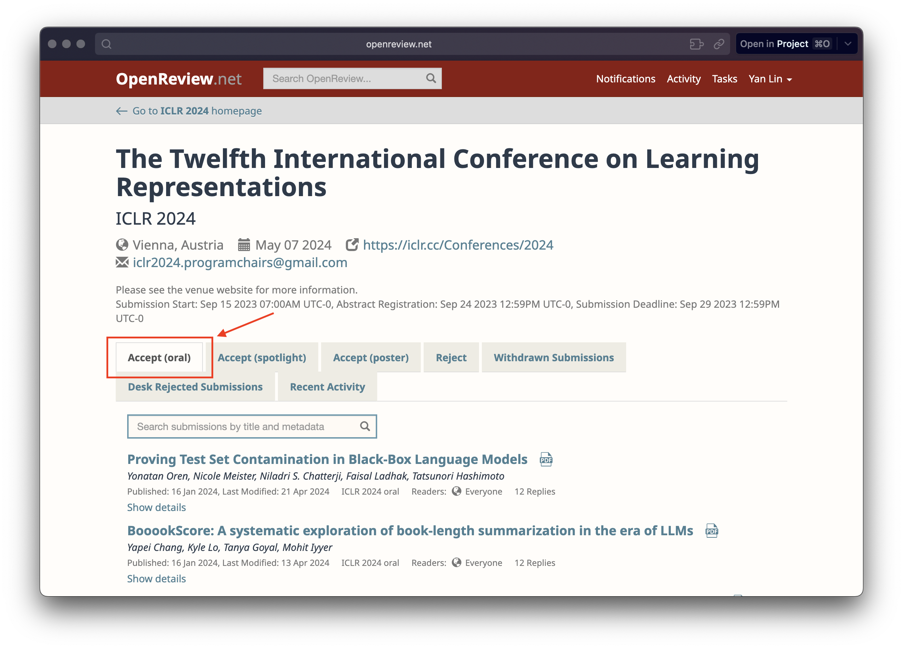
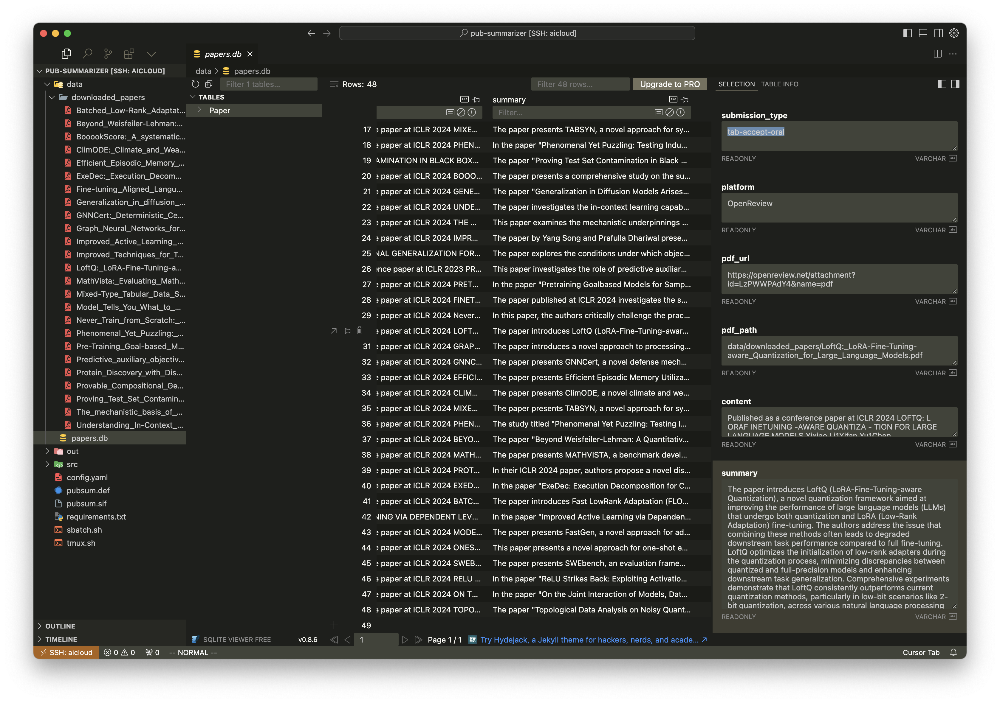
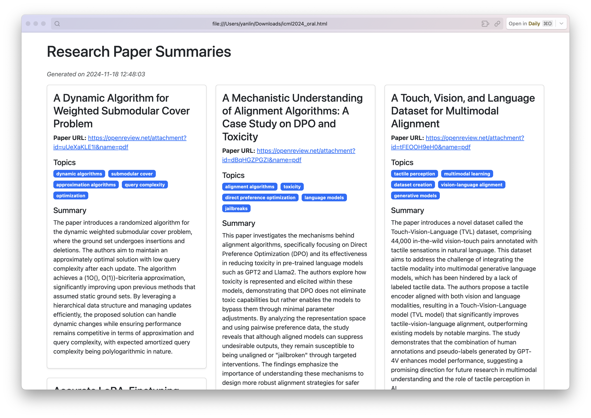

# PubSummarizer

The Publication Summarizer is a tool designed to scrape, parse, and summarize academic papers from conferences and journals. This tool downloads the PDFs of papers, extracts text, and generates summaries using various language models.

The idea behind this project is to enable a quick review of all the accepted papers from a conference to find papers that are potentially interesting for you to read. Seeing that the number of accepted papers grows so fast, this task is becoming increasingly difficult to do manually.

## Modules

### Scraper

The `Scraper` module (implemented in `pdf_scraper.py`) is responsible for collecting academic papers from online platforms. It uses Selenium with a Firefox web driver to navigate and scrape data from websites like OpenReview with a specified filter. The module handles pagination and extracts paper titles and PDF URLs. It also includes functionality to check for Firefox installation and set up the web driver.

> **Note:** Currently, only OpenReview is supported, but support for other platforms is planned.

### Parser

The `Parser` module (implemented in `pdf_parser.py`) processes downloaded PDFs to extract text. It attempts to extract text using multiple methods: PyPDF2 for direct text extraction, pdfminer for more complex layouts, and OCR via pytesseract for scanned PDFs. The module also includes a cleaning function to remove unwanted characters and whitespace from the extracted text.

### Summarizer

The `Summarizer` module (implemented in `summarizer.py`) generates summaries of the extracted text using various language models. Currently, it supports models from HuggingFace, OpenAI, and Anthropic. The module constructs prompts with specified prefixes and suffixes and uses the chosen model to generate a summary of the text.

### Database

The `Database` module (implemented in `sql.py`) provides a simple interface for interacting with a SQLite database. It includes functionality for creating tables, inserting paper entries, and querying the database.

## Installation

The project requires Python and several libraries. Specifically, the `Scraper` module requires a Firefox ESR browser to be installed, and the `Parser` module requires a `tesseract-ocr` module to be installed. On a Debian-based system, you can install these dependencies using:

```bash
sudo apt install tesseract-ocr firefox-esr -y
```

You can then install the required Python packages using the `requirements.txt` file:

```bash
pip install -r requirements.txt
```

I recommend using some form of virtual environment to manage the dependencies. You can find the definition file for building a Singularity container in `pubsum.def`, which is the tool I use to run the code. To build the container, run:

```bash
singularity build --nv --fakeroot pubsum.sif pubsum.def
```

## Usage

Let's assume we want to scrape all ICLR 2024 oral papers and summarize them. 

### Check the filters

The first step is to prepare a configuration file to specify the correct filters. For OpenReview, you can first navigate to the page: https://openreview.net/group?id=ICLR.cc/2024/Conference, and click on the "Oral" track tab.



Now, if you check the URL in your browser, you will see something like this: https://openreview.net/group?id=ICLR.cc/2024/Conference#tab-accept-oral. The part we care about is `tab-accept-oral`, which is the submission type that will be used in the filter.

### Prepare the configuration file

Based on the above filter information, we can create a configuration file as:

```yaml
scraping:
  platform: OpenReview
  conference: ICLR
  year: 2024
  track: Conference
  submission_type: tab-accept-oral
  delay: 1

paths:
  output_dir: data/downloaded_papers
  db_path: sqlite:///data/papers.db

summarization:
  provider: hf
  model_name: facebook/opt-350m
  prefix: "Summarize the following paper in one concise paragraph:"
  suffix: "Summary:"
  param:
    max_new_tokens: 1000
    do_sample: true
    temperature: 0.7
```

The `scraping` section specifies the platform, and the filters we just checked. The `paths` section specifies the output directory for downloaded papers and the path to store the SQLite database. The `summarization` section specifies the provider, model name, prefix, suffix, and parameters for the summarization. The prompt fed into the LM will be `prefix + paper content + suffix`.

You can also find the example configuration file in `config.yaml`.

### Run the script

You can now run the script using:

```bash
python src/main.py -c config.yaml
```

For using the Singularity container, you can run:

```bash
singularity run --nv pubsum.sif python3 src/main.py -c config.yaml
```

This will download the papers, parse the text, and summarize them. The results will be stored in the SQLite database specified in the configuration file.

If you want to use the OpenAI API, you can change the `summarization` section in the configuration file to:

```yaml
summarization:
  provider: openai
  model_name: gpt-4o
  param:
    max_tokens: 1000
    temperature: 0.7
```

Similarly, if you want to use Anthropic, you can change the `summarization` section in the configuration file to:

```yaml
summarization:
  provider: anthropic
  model_name: claude-3-5-sonnet-20241022
  param:
    max_tokens: 1000
    temperature: 0.7
```

And you also want to specific your OpenAI and Anthropic API keys in your environment variables.

```bash
export OPENAI_API_KEY=<your-openai-api-key>
export ANTHROPIC_API_KEY=<your-anthropic-api-key>
```

> **Note:** Using paid API calls from OpenAI or Anthropic will be expensive, especially if you want to summarize thousands of papers. If you have access to "free" computational resources, you might want to use open-sourced models from HuggingFace to save costs.

### View the results

You can now view the results in the SQLite database with any SQL client you like. For example, you can use the `sqlite3` command-line tool to view the results:

```bash
sqlite3 data/papers.db
```

Or you can use a GUI tool like the SQLite Viewer plugin for VSCode.



This is certainly not a very elegant solution, but it gets the job done. Alternatively, you can export the results to a markdown file or an HTML file using the `exporter.py` script.

### Export the results

As we said, the results are stored in an SQLite database. You can export the results to a markdown file or an HTML file using the `exporter.py` script.

```bash
# Export to markdown
python src/exporter.py --db_url sqlite:///data/papers.db --output_path data/papers.md --format markdown

# Export to HTML
python src/exporter.py --db_url sqlite:///data/papers.db --output_path data/papers.html --format html
```

The HTML file is styled with Bootstrap and Masonry layout, and you can view it in your browser or host it on any static file server.



## Future work

Currently, this tool is in a very early stage of development. Here are some of the things I plan to add in the future:

- [/] Add a web interface for easier access to the results and potentially to fully control the whole process.
- [ ] Add a way to filter the papers based on keywords, titles, etc.
- [ ] Explore more advanced prompts and procedures for more comprehensive summaries.

While it might seem feasible to summarize all papers from major conferences and journals and release the results as a static website, there are still valuable use cases for customizing the tool yourself. This allows you to use different models and prompts to achieve the most suitable results for your needs. Additionally, I cannot fully account for the vast diversity of conferences and journals. In the future, an interactive summarization module might be implemented, enabling you to chat with the LLM to refine the results. At that point, hosting a dynamic website for everyone to interact with would be impractical for me.

If you have any ideas or suggestions on the future work, or you find some bugs, feel free to let me know by opening an issue or send me an email. My contact information can be found on my [homepage](https://www.yanlincs.com).